# 📈 A Modern Stock Broking App

A React Native mobile application that simulates a stock trading experience. It enables users to explore real-time market data, manage their watchlist, and make smarter investment decisions — all within a sleek and responsive interface.

---

## Features

**Real-Time Market Data** – Displays live stock prices and trends.
**Watchlist Management** – Add, remove, and track your favorite stocks.
**Interactive UI/UX** – Built with modern React Native components and optimized for smooth navigation.
**API-Driven** – Fetches data from secure APIs using environment variables.
**State Management** – Powered by efficient global stores for seamless updates.

---

## Tech Stack

| Category                   | Technology                                |
| -------------------------- | ----------------------------------------- |
| **Frontend**               | React Native (Expo)                       |
| **Language**               | TypeScript                                |
| **State Management**       | Zustand / Redux (depending on your setup) |
| **API Handling**           | Axios / Fetch                             |
| **Environment Management** | react-native-dotenv                       |
| **Navigation**             | Expo Router / React Navigation            |

---

## Setup and Installation

1. **Clone the Repository**

   ```bash
   git clone https://github.com/<your-username>/StockSell.git
   cd StockSell
   ```

2. **Install Dependencies**

   ```bash
   npm install
   ```

3. **Set Up Environment Variables**
   Create a `.env` file in the root directory:

   ```
   API_URL=https://your-api-endpoint.com
   API_KEY=your_api_key_here
   ```

4. **Start the App**

   ```bash
   npx expo start
   ```

   Scan the QR code to open it in Expo Go or run on an emulator.

---


## 📸 Screenshots

### Dark Mode
<p align="center">
  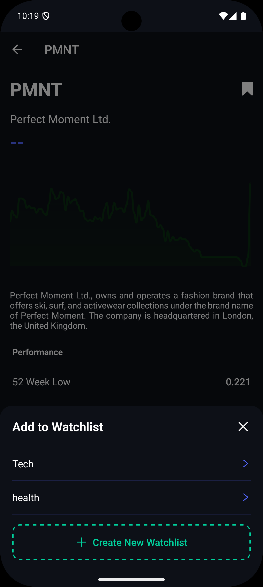
  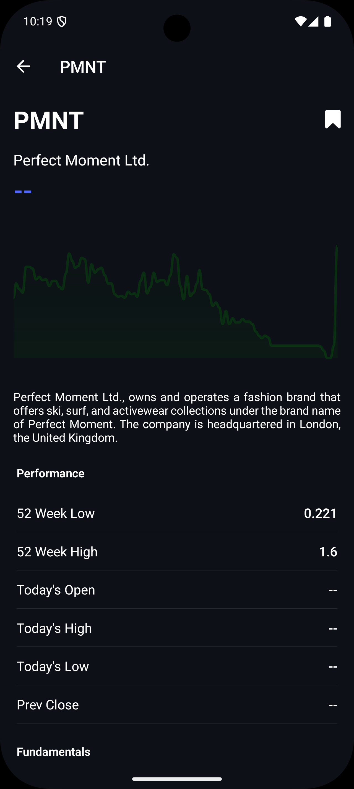
  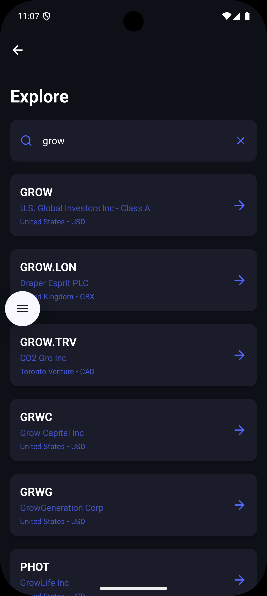
  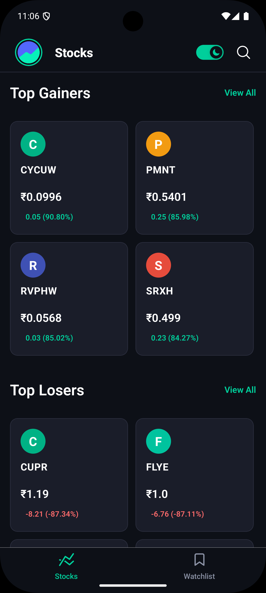
  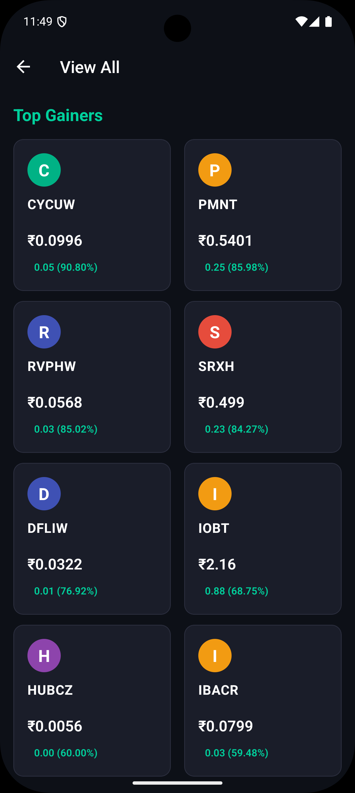
  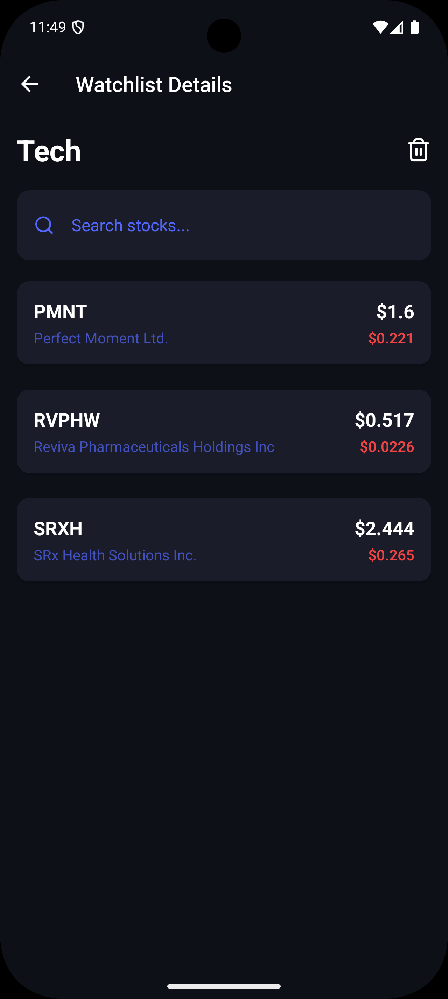
  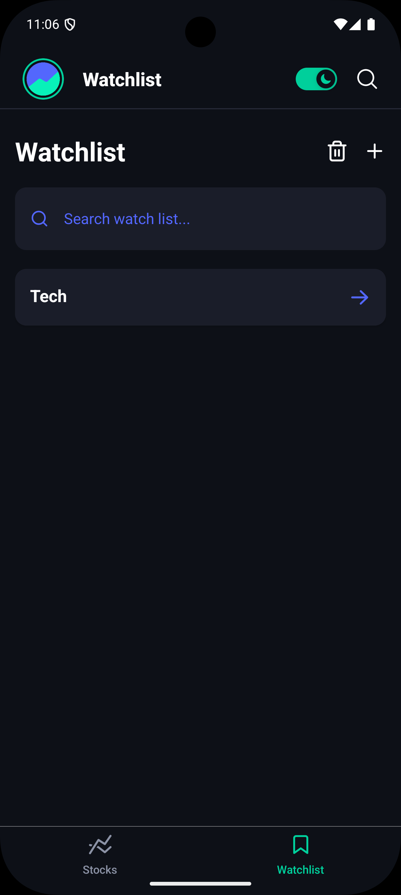
</p>

### Light Mode
<p align="center">
  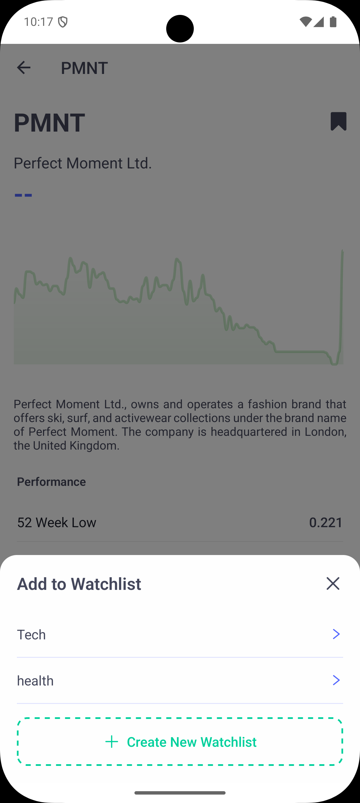
  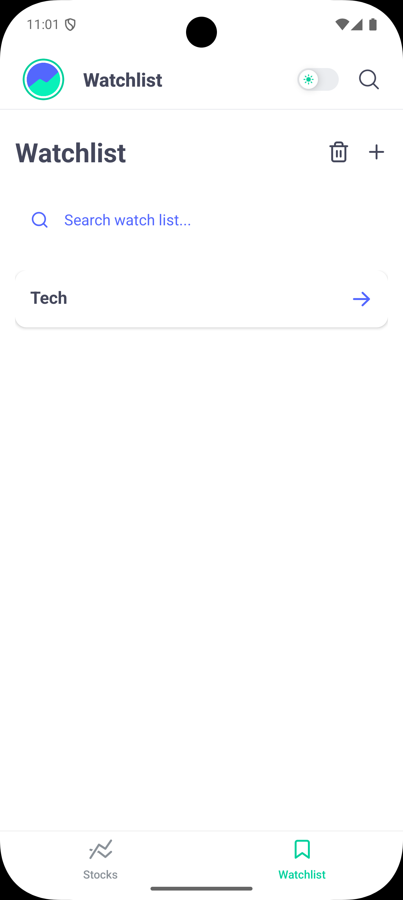
  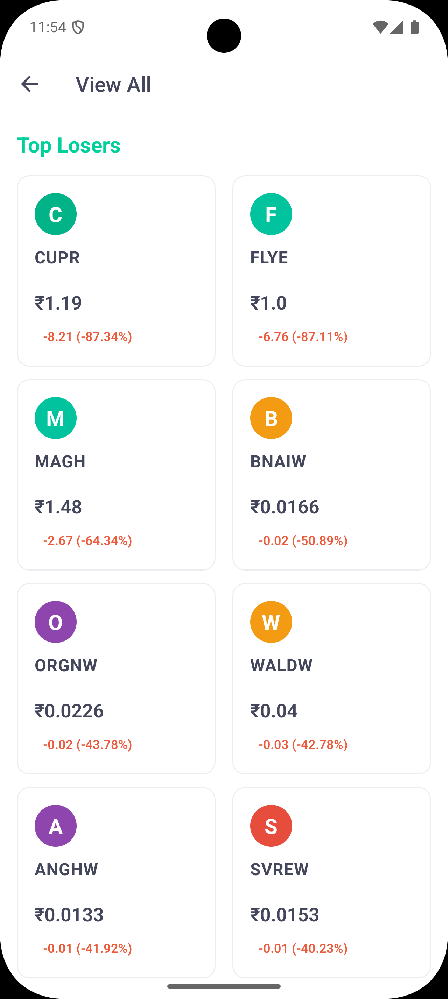
  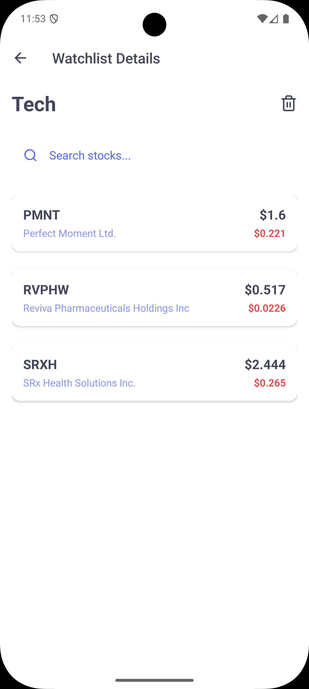
  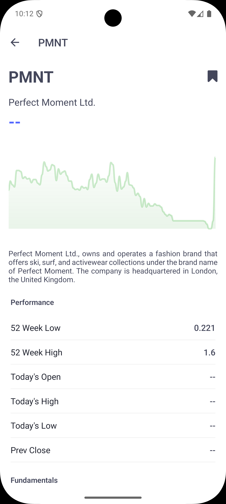
</p>

---


